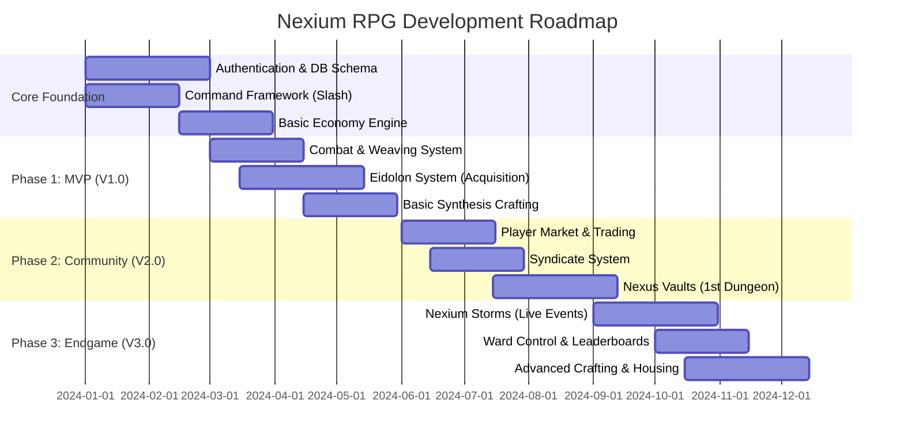

# **Nexium RPG: The Eidolon Protocol**

## **Project Proposal & Comprehensive Overview**

**From:** Project Development Team
**Date:** Semptember 8, 2025
**Subject:** Proposal for a Groundbreaking Discord-Based RPG Ecosystem

---

### **1. Executive Summary**

**Nexium RPG: The Eidolon Protocol** is a next-generation Discord bot designed to redefine social gaming within digital communities. Moving far beyond cliché RPG tropes, Nexium offers a sophisticated, puzzle-driven experience set in a unique urban science-fantasy world. Its core innovation is the **Eidolon Protocol**, a system where players bond with collectible spectral entities through strategic combat and deep narrative integration.

This document outlines a complete, synergistic ecosystem featuring a player-driven economy, challenging cooperative dungeons, a strategic crafting minigame, and competitive guild mechanics—all designed to foster unprecedented levels of user engagement, retention, and community growth.

### **2. Vision & Mission**

* **Vision:** To create the most engaging, intellectually stimulating, and community-oriented RPG experience on the Discord platform.
* **Mission:** To leverage Discord's social framework to deliver a game that values strategy and cooperation over mindless grinding, powered by a sustainable economy and a constantly evolving world.

### **3. Core Differentiators (The "Why Nexium?")**

| Feature | Standard RPG Bots | **Nexium RPG** |
| :--- | :--- | :--- |
| **Combat** | Repetitive `!attack` grinding | **Puzzle-based `/weave` system** requiring logic and analysis. |
| **Collection** | Generic monster collection | **Narrative-rich Eidolons** with stories, bonds, and synergy. |
| **Economy** | Basic shops, prone to inflation | **Self-regulating, dual-currency, player-driven market.** |
| **Progression** | Linear gear grind | **Horizontal progression** through Sync Ratios, crafting quality, and Eidolon bonds. |
| **Community** | Individual-focused | **Deeply integrated cooperation** through Syndicates, Dungeons, and World Events. |

### **4. Detailed System Breakdown**

#### **4.1. The Eidolon Protocol (Collection & Progression)**

The heart of the player experience.

* **Concept:** Players are "Weavers" who stabilize spectral impressions of lost beings, known as **Eidolons**.
* **Acquisition:** Via `/attune`, using **Tuners** earned through gameplay.
* **Progression:**
  * **Leveling:** Eidolons gain EXP from combat.
  * **Ascension:** Break level caps using materials from dismantled duplicates.
  * **Sync Ratio:** A bond mechanic where an Eidolon's effectiveness scales based on usage and interaction (`/eidolon interact`), unlocking more of their story.
* **Examples:** `Seraphina, the Final Verse` (SSR Composer), `Kaelen, the Unraveled` (SSR Architect), `Bexley, the Iron Sentinel` (SR Guardian).

#### **4.2. Puzzle-Based Combat System**

Replaces traditional turn-based combat with intellectual engagement.

* **`/scan [enemy]`:** Reveals a target's weakness via a private DM. This can be a pattern, riddle, or code.
* **`/weave [sequence]`:** The player inputs a logical sequence to exploit the weakness (e.g., `NOT Fire`, `Water AND Ice`).
* **Eidolon Skills:** `/skill [skill_name]` unleashes an Eidolon's unique ability, often powered by successful weaves.
* **Result:** Every combat encounter is a unique puzzle, eliminating grind and rewarding smart play.

#### **4.3. The Nexium Economy**

A dual-engine system designed for long-term stability.

* **Nexium (NEX):** **Soulbound.** Earned from combat and quests. Used as fuel for the crafting (`/synthesize`) system. **Prevents inflation.**
* **Cred (CRD):** **Tradable.** Earned from selling items, events, and bounties. Used for **player-to-player trading**, cosmetics, and housing.
* **Player Market:** Facilitated by `/market list` and `/market buy`. The best gear is player-crafted, making crafters vital to the economy.
* **Secure Trading:** The `/trade [@user]` command creates a bot-mediated, secure channel for safe P2P item and Cred exchange.

#### **4.4. Synthesis Crafting System**

A deep, minigame-based crafting system.

* **Process:** `/synthesize [recipe]` opens a grid-based interface.
* **Gameplay:** Players place material fragments onto the grid, managing interactions between volatile and stable components.
* **Quality Tiers:** The configuration's stability determines the item's quality: **Unstable → Stable → Optimized → Flawless.**
* **Purpose:** Creates a high skill ceiling for crafters and provides the entire game's best equipment.

#### **4.5. Nexus Vaults (PvE Dungeons)**

Instanced, thematic, multi-stage challenges for 1-4 players.

* **Concept:** Pocket dimensions within the Shattered Spire (e.g., "The Glitched Cathedral").
* **Features:** Procedural elements, unique environmental mechanics, and bosses that require coordinated `/weave` commands from the entire party.
* **Rewards:** Exclusive crafting materials, high-value Tuners, and cosmetics.

#### **4.6. Syndicates & Ward Control (Guilds)**

Guilds, known as **Syndicates**, compete for control of Neo-Avalon's districts.

* **Mechanic:** Syndicates use resources to `/claim` a ward for a weekly buff (e.g., reduced crafting cost).
* **Conflict:** Challenges are resolved via **PvE Leaderboards**, not toxic PvP. Challengers must post a faster clear time of a specific Nexus Vault to seize control.
* **Benefit:** Encourages healthy, cooperative competition within and between Syndicates.

#### **4.7. Live Service: Nexium Storms**

Dynamic, server-wide events that make the Discord server itself feel alive.

* **During a Storm:** Channel names and themes change, rare enemies appear, and unique mechanics are activated.
* **Resolution:** Players cooperate using the `/calm` command, contributing resources and solving puzzles to end the storm.
* **Reward:** Server-wide bonuses and rare loot. Fosters a sense of shared community achievement.

### **5. Technical Architecture**

* **Platform:** Node.js
* **Library:** Discord.js (v14+), utilizing full Slash Command and Context Menu capabilities.
* **Database:** PostgreSQL for robust data management and future scalability.
* **UX:** Modern, intuitive Slash Command (`/`) interface for seamless user experience.

### **6. Development Roadmap & Timeline**



### **7. Mock-Up: User Experience Flow**

```
1.  User joins Discord server, uses `/profile create`.
2.  Encounters a "Data Glitch," uses `/scan`.
    -> *Bot DMs them a riddle: "It fears the logic it cannot compute."*
3.  Deduces the solution, uses `/weave NOT Logic`.
    -> *Bot replies in-channel: "Critical Hit! 350 damage. Earned 50 NEX, 1 Tuner."*
4.  Uses `/attune` with the Tuner.
    -> *Bot reveals a new SSR Eidolon: `Zohar, the Forgotten Archive`.*
5.  Teams up with Syndicate members via `/party find` to tackle the "Rust-Scale Bazaar" vault.
6.  Crafts a new weapon with materials won, sells a duplicate on the market with `/market list`.
7.  Uses earned Cred to upgrade their Syndicate's ward, benefiting the entire community.
```

### **8. Conclusion & Investment Summary**

**Nexium RPG: The Eidolon Protocol** is more than a feature list; it is a visionary ecosystem designed to capture and retain user attention in a crowded market. Its unique puzzle-combat, profound collection system, and deeply interconnected economy create a virtuous cycle of engagement that no other Discord bot offers.

We are not building another RPG bot. **We are building a world.**

We are requesting approval to proceed with the development roadmap outlined herein. The foundation is designed, the vision is clear, and the market is ready for a product of this caliber.
